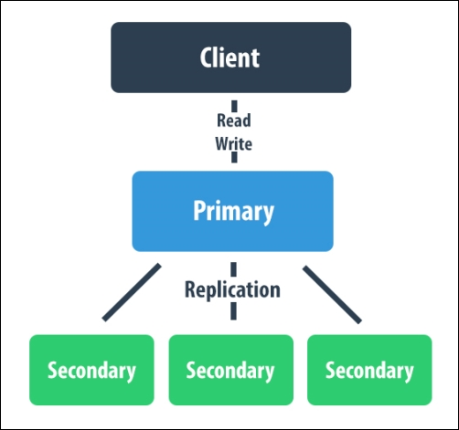

#### Replication

MongoDB replication is the process of creating a copy of the same data set in more than one MongoDB server. This can be achieved by using a Replica Set. 

**Replication provides :**

- Data redundancy
- High availability of data
- Failover occurs automatically.
- Recovery is done automatically.
- Primary election by consensus.

**Features :**

A minimum of 3 nodes are required.

One node is the primary node ( READ/WRITE).

All other nodes will be secondaries (READ ONLY). 

There can only be one primary node in a replica set.

During failber or maintenance, a new primary node is elected.

After a failed node is recovered, it rejoins the replica set and becomes a secondary node.



**Initializing the Replica Set**

```
kubectl apply -f replicaset/rbac.yaml
kubectl apply -f replicaset/svc.yaml
kubectl apply -f replicaset/sts.yaml
```

```
sh replicaset/post-install.sh
```

**Testing Replication**

Connect to primary and insert data

```
kubectl exec -it mongodb-replica-0 -n default -- mongo

rs0:PRIMARY> use movies
switched to db movies

rs0:PRIMARY> db.release.insertOne({name: "sunrise", year: 2020})
{
        "acknowledged" : true,
        "insertedId" : ObjectId("62b49e06193ee3df1645594c")
}

rs0:PRIMARY> exit
```

Connect to the secondary and verify data

```
kubectl exec -it mongodb-replica-2 -n default -- mongo

rs0:SECONDARY> rs.secondaryOk()

rs0:SECONDARY> db.release.find();
{ "_id" : ObjectId("62b49e06193ee3df1645594c"), "name" : "sunrise", "year" : 2020 }

rs0:SECONDARY>
```