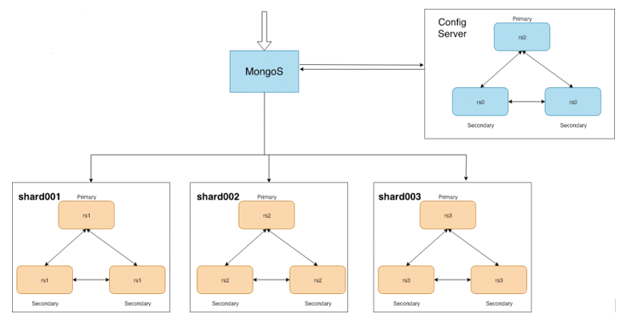

### Mongodb-Shard-Cluster


MongoDB Sharding provides a mechanism to distribute the dataset on multiple nodes also called shards. MongoDB uses sharding to deploy large datasets and support high throughput operations. 

#### Components of MongoDB Sharding

MongoDB Sharded cluster consists of three components.

    - Routers
    - Config Server Replicasets
    - Shards Replicaset




### Create MongoDB Cluster


#### Config Nodes


**Create configuration nodes**

```
kubectl apply -f shards/mongo_config.yaml

kubectl get pods 
```

**Initiate config node replisets**

```
CMD='rs.initiate({ _id : "cfgrs", configsvr: true, members: [{ _id : 0, host : "mongocfg-0.mongocfg:27019" },{ _id : 1, host : "mongocfg-1.mongocfg:27019" },{ _id : 2, host : "mongocfg-2.mongocfg:27019" }]})'

kubectl exec -it mongocfg-0 -- bash -c "mongo --port 27019 --eval '$CMD'"
```


#### Data Nodes


**Create 3 shards (data nodes)**

```
kubectl apply -f shards/mongo_shard_1.yaml
kubectl apply -f shards/mongo_shard_2.yaml
kubectl apply -f shards/mongo_shard_3.yaml
```

**Create replicaset for each shard**

initialize shard-0 replication

```
CMD="rs.initiate({ _id : \"rs1\", members: [{ _id : 0, host : \"mongo-shard-1-0.mongo-shard-1:27017\" },{ _id : 1, host : \"mongo-shard-1-1.mongo-shard-1:27017\" },{ _id : 2, host : \"mongo-shard-1-2.mongo-shard-1:27017\" }]})"

echo $CMD
    
kubectl exec -it mongo-shard-1-0 -- bash -c "mongo --eval '$CMD'"
```

initialize shard-1 replication

```
CMD="rs.initiate({ _id : \"rs2\", members: [{ _id : 0, host : \"mongo-shard-2-0.mongo-shard-2:27017\" },{ _id : 1, host : \"mongo-shard-2-1.mongo-shard-2:27017\" },{ _id : 2, host : \"mongo-shard-2-2.mongo-shard-2:27017\" }]})"

echo $CMD
    
kubectl exec -it mongo-shard-2-0 -- bash -c "mongo --eval '$CMD'"
```

Initialize shard-2 replication

```
CMD="rs.initiate({ _id : \"rs3\", members: [{ _id : 0, host : \"mongo-shard-3-0.mongo-shard-3:27017\" },{ _id : 1, host : \"mongo-shard-3-1.mongo-shard-3:27017\" },{ _id : 2, host : \"mongo-shard-3-2.mongo-shard-3:27017\" }]})"

echo $CMD
    
kubectl exec -it mongo-shard-3-0 -- bash -c "mongo --eval '$CMD'"
```

#### Router Nodes


**Create Query Router nodes**

```
kubectl create -f shards/mongo_router.yaml
```

**Add shards to the router node**


```
CMD="sh.addShard(\"rs1/mongo-shard-1-0.mongo-shard-1:27017\")"

kubectl exec -it mongos-0 -- bash -c "mongo --eval '$CMD'"

CMD="sh.addShard(\"rs2/mongo-shard-2-0.mongo-shard-2:27017\")"

kubectl exec -it mongos-0 -- bash -c "mongo --eval '$CMD'"

CMD="sh.addShard(\"rs3/mongo-shard-3-0.mongo-shard-3:27017\")"

kubectl exec -it mongos-0 -- bash -c "mongo --eval '$CMD'"
```


#### Verify Cluster status

```
kubectl exec -it mongos-0 -n default -- mongo
sh.status()


kubectl exec -it mongos-1 -n default -- mongo
sh.status()
```

#### Enable collection sharding and test  

Once the Sharded Cluster has been set up, Sharding for the required database has to be enabled. 

Connect to the mongos instance 

`kubectl exec -it mongos-0 -n default -- mongo`

```
mongos> use census;
switched to db census

mongos> sh.enableSharding("populations")
{
        "ok" : 1,
        "operationTime" : Timestamp(1656349870, 4),
        "$clusterTime" : {
                "clusterTime" : Timestamp(1656349870, 4),
                "signature" : {
                        "hash" : BinData(0,"AAAAAAAAAAAAAAAAAAAAAAAAAAA="),
                        "keyId" : NumberLong(0)
                }
        }
}

mongos> sh.shardCollection("populations.cities", { "country": "hashed" })
{
        "collectionsharded" : "populations.cities",
        "collectionUUID" : UUID("c7ad2de8-9f4f-41d9-bec6-15869ec5c51d"),
        "ok" : 1,
        "operationTime" : Timestamp(1656349919, 12),
        "$clusterTime" : {
                "clusterTime" : Timestamp(1656349919, 12),
                "signature" : {
                        "hash" : BinData(0,"AAAAAAAAAAAAAAAAAAAAAAAAAAA="),
                        "keyId" : NumberLong(0)
                }
        }
}

mongos> db.cities.insertMany([
    {"name": "Seoul", "country": "South Korea", "continent": "Asia", "population": 25.674 },
    {"name": "Mumbai", "country": "India", "continent": "Asia", "population": 19.980 },
    {"name": "Lagos", "country": "Nigeria", "continent": "Africa", "population": 13.463 },
    {"name": "Beijing", "country": "China", "continent": "Asia", "population": 19.618 },
    {"name": "Shanghai", "country": "China", "continent": "Asia", "population": 25.582 },
    {"name": "Osaka", "country": "Japan", "continent": "Asia", "population": 19.281 },
    {"name": "Cairo", "country": "Egypt", "continent": "Africa", "population": 20.076 },
    {"name": "Tokyo", "country": "Japan", "continent": "Asia", "population": 37.400 },
    {"name": "Karachi", "country": "Pakistan", "continent": "Asia", "population": 15.400 },
    {"name": "Dhaka", "country": "Bangladesh", "continent": "Asia", "population": 19.578 },
    {"name": "Rio de Janeiro", "country": "Brazil", "continent": "South America", "population": 13.293 },
    {"name": "São Paulo", "country": "Brazil", "continent": "South America", "population": 21.650 },
    {"name": "Mexico City", "country": "Mexico", "continent": "North America", "population": 21.581 },
    {"name": "Delhi", "country": "India", "continent": "Asia", "population": 28.514 },
    {"name": "Buenos Aires", "country": "Argentina", "continent": "South America", "population": 14.967 },
    {"name": "Kolkata", "country": "India", "continent": "Asia", "population": 14.681 },
    {"name": "New York", "country": "United States", "continent": "North America", "population": 18.819 },
    {"name": "Manila", "country": "Philippines", "continent": "Asia", "population": 13.482 },
    {"name": "Chongqing", "country": "China", "continent": "Asia", "population": 14.838 },
    {"name": "Istanbul", "country": "Turkey", "continent": "Europe", "population": 14.751 }
])


mongos> db.cities.getShardDistribution()

Shard rs1 at rs1/mongo-shard-1-0.mongo-shard-1:27017,mongo-shard-1-1.mongo-shard-1:27017,mongo-shard-1-2.mongo-shard-1:27017
 data : 512B docs : 5 chunks : 2
 estimated data per chunk : 256B
 estimated docs per chunk : 2

Shard rs2 at rs2/mongo-shard-2-0.mongo-shard-2:27017,mongo-shard-2-1.mongo-shard-2:27017,mongo-shard-2-2.mongo-shard-2:27017
 data : 1015B docs : 10 chunks : 2
 estimated data per chunk : 507B
 estimated docs per chunk : 5

Shard rs3 at rs3/mongo-shard-3-0.mongo-shard-3:27017,mongo-shard-3-1.mongo-shard-3:27017,mongo-shard-3-2.mongo-shard-3:27017
 data : 550B docs : 5 chunks : 2
 estimated data per chunk : 275B
 estimated docs per chunk : 2

Totals
 data : 2KiB docs : 20 chunks : 6
 Shard rs1 contains 24.65% data, 25% docs in cluster, avg obj size on shard : 102B
 Shard rs2 contains 48.86% data, 50% docs in cluster, avg obj size on shard : 101B
 Shard rs3 contains 26.48% data, 25% docs in cluster, avg obj size on shard : 110B


mongos> db.cities.find().explain()
. . .
. . .
. . .

```
